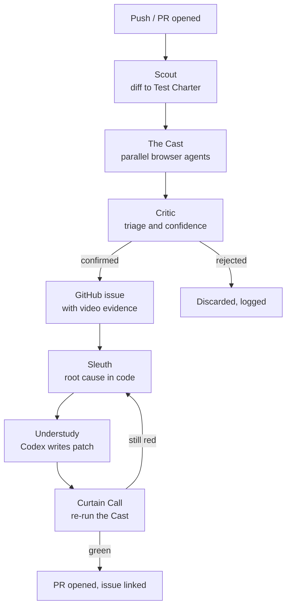
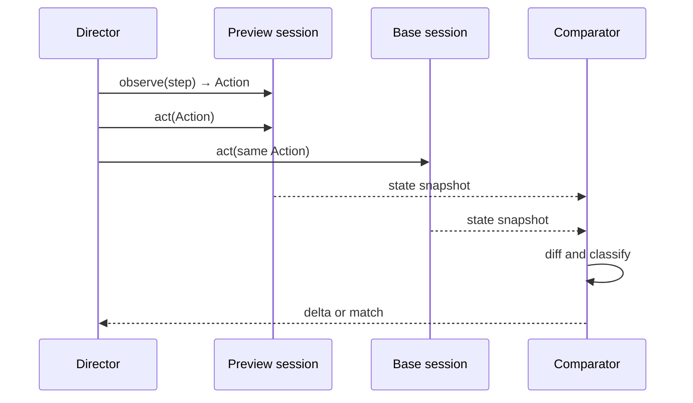
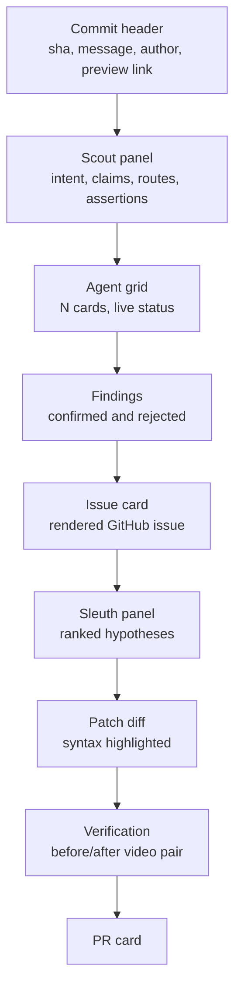
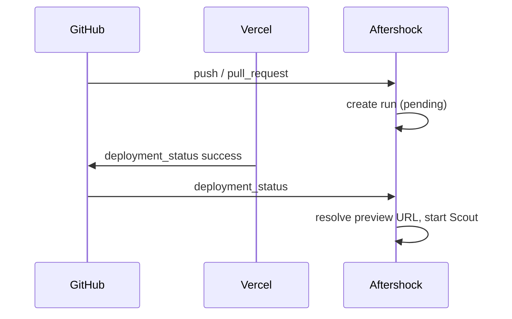

# Aftershock

**Autonomous QA and repair for every commit.**

2026-09-19 · @Shauraya Mohan

## Summary

Aftershock is an autonomous QA and repair layer that runs on every commit. When a developer pushes, Greenroom reads the diff, infers what the developer claimed to build, dispatches a fleet of parallel browser agents to test that claim end-to-end against a live preview deployment, captures video and screenshot evidence of anything that breaks, files a fully-documented GitHub issue, diagnoses the root cause in the codebase, writes a patch, opens a pull request, and re-runs the fleet to prove the patch works.

The pitch in one line: **your commit walks into a room full of testers, and walks out with a fix.**

This specifies the build for Hack the North 2026 — a 36-hour window, targeting the Browserbase prize ($2,000, best use of Browserbase), the OpenAI API prize (Codex as both a build teammate and a runtime component), the Warp prize (best developer tool, no API requirement), and the main finalist award.

The name is deliberate. An aftershock is the tremor that follows the main event and reveals what the first shock actually broke. Aftershock is what runs the moment you ship.

## The problem

CI proves your code compiles and that the tests someone already wrote still pass. It proves nothing about the thing you just built.

Three gaps follow from that:

**New code is the least tested code.** A feature shipped an hour ago has no test coverage by definition. The tests that exist were written for the behaviour that existed before. Coverage is inversely correlated with risk.

**Nobody writes end-to-end tests under deadline.** They are slow to write, slow to run, and brittle. On a small team they are the first thing cut and the last thing restored.

**Preview deploys are a link, not a verdict.** Vercel tells you the build succeeded and hands you a URL. Whether the signup flow still works is left as an exercise for whoever clicks it, which on a fast-moving team is often nobody until a user complains.

### Why existing AI QA tools do not close this

A crowded field already tries: QA Wolf, Momentic, Octomind, Meticulous, Ranger. Most converge on the same shape — an agent explores the app, watches for errors, and reports what it saw. That shape has a structural defect we call the **oracle problem**.

When an agent explores a freshly shipped feature and sees behaviour it did not expect, how does it know that is a bug rather than the feature? The entire point of a new commit is that behaviour changed on purpose. Without a notion of intended behaviour, an exploring agent can only detect things that are unambiguously wrong in any context: uncaught exceptions, console errors, 4xx and 5xx responses, blank pages.

That is a smoke test with a language model bolted on. It catches crashes, misses logic, and produces enough false positives that developers stop reading the output. A QA tool nobody trusts is worse than no QA tool, because it consumes attention and returns noise.

Aftershock's design starts from the oracle problem rather than ignoring it.

## The core insight

Aftershock solves the oracle problem twice, with two independent mechanisms. Neither requires anyone to have written a test.

### Oracle 1 — intent extracted from the diff

Every commit ships with a statement of intent that nobody machine-reads: the commit message, the PR title and body, the branch name, and the diff itself. A developer who writes `feat: add coupon codes at checkout` and touches `CouponInput.tsx`, `applyDiscount.ts`, and `checkout.test.ts` has told you exactly what should now be true.

Aftershock converts that into explicit, checkable assertions before any browser opens:

- Applying a valid coupon reduces the displayed total
- An invalid coupon shows an error and does not change the total
- The coupon field appears on the checkout page and nowhere else
- Checkout still completes with no coupon at all

Now the agents have a specification. A finding is a bug when observed behaviour contradicts an assertion derived from the developer's own stated intent. That is a defensible claim, and it is the claim that goes in the issue.

### Oracle 2 — differential execution against the base

The second oracle needs no specification at all, and it is the stronger of the two.

Run the same journey twice, simultaneously: once against the preview deployment of the new commit, once against the deployment of the base branch. Two Browserbase sessions, same steps, same inputs, same timing. Then diff everything observable — rendered text, DOM structure, network calls, status codes, console output, final URL, screenshots.

Any behavioural difference falls into exactly one of two buckets:

1. **Claimed.** The diff said this would change. Expected, and worth confirming it changed in the direction claimed.
2. **Unclaimed.** The diff said nothing about this. That is a regression, by construction.

This is the key move. It gives a correctness signal without knowing what correct means, because the base branch defines correct. It catches the class of bug that matters most and that smoke tests miss entirely: the thing you broke somewhere else while building the thing you meant to build.

### Why this is the moat

Everything downstream depends on findings being trustworthy. Screenshots, video, issue formatting, automated patches — all of it is worthless if the findings are noise, and all of it is valuable if they are not.

The pitch line is: **we do not test your app, we test your diff.**

## Product overview

Seven stages, fully automatic, from push to verified fix.



**1. Trigger.** A push or PR event arrives by webhook. Aftershock waits for the preview deployment to go live.

**2. Scout.** Reads the diff, commit message, PR body and changed files. Produces a Test Charter: inferred intent, affected routes, and a list of explicit assertions.

**3. The Cast.** Aftershock spins up N Browserbase sessions in parallel. Each agent gets one assignment from the charter. Some verify the new feature against its claimed intent; others run the same journey against both preview and base and diff the results. Every session is recorded.

**4. Critic.** Collects raw findings, deduplicates, replays anything unconfirmed to filter flakes, scores confidence, and discards everything below threshold. Survivors become GitHub issues with screenshots, embedded video, network traces, and minimal reproduction steps.

**5. Sleuth.** Takes a confirmed issue and localises it in the codebase. Maps the failing UI behaviour back to specific files and lines, using the diff as the prime suspect list.

**6. Understudy.** Wraps Codex. Given the issue, the root-cause hypothesis and the repository, it writes a patch on a new branch.

**7. Curtain Call.** The patch gets its own preview deployment. The original failing agents re-run against it. Only if they pass does the PR open, linked to the issue it closes, with before-and-after video attached.

The developer's inbox gets one notification: a PR that fixes a bug they did not know they had, with proof.

## The agent cast

Seven roles. Each has a narrow contract, its own model choice, and a defined failure behaviour. Narrow contracts are what make a multi-agent system debuggable at 4am.

| Agent | Role | Input | Output | Model | On failure |
| --- | --- | --- | --- | --- | --- |
| Director | Orchestrator and state machine. Owns the run, allocates browser concurrency, persists everything | Webhook event | Run record, stage transitions | None (deterministic code) | Marks run failed, surfaces partial results |
| Scout | Diff intelligence. Infers intent, maps routes, writes assertions | Diff, commit message, PR body, file tree | Test Charter (JSON) | GPT-5 class, reasoning | Falls back to generic smoke charter over changed routes |
| The Cast | N parallel browser agents executing charter assignments | One assignment each | Raw findings, screenshots, session IDs | Stagehand inference model + Agents API | Agent marked errored, run continues with the rest |
| Critic | Triage. Dedupe, flake filtering, confidence scoring, issue authoring | All raw findings | Confirmed findings, GitHub issues | GPT-5 class | Nothing filed; findings visible in dashboard only |
| Sleuth | Root cause localisation in the codebase | Issue, diff, repo tree, failing trace | Ranked file/line hypotheses | GPT-5 class with repo context | Hands Understudy the issue with no hypothesis |
| Understudy | Patch generation | Issue plus hypothesis plus repo | Branch with commits | Codex | Comments the diagnosis on the issue, no PR |
| Curtain Call | Verification. Re-runs the failing subset against the fix | Fix preview URL, original assignments | Pass/fail per assignment | Reuses the Cast | PR opens as draft, marked unverified |

### Design rules for the cast

**One agent, one question.** No agent both finds and judges. The Cast reports what it saw; the Critic decides what it means. This separation is what makes the confidence model possible — a tester that grades its own work grades generously.

**Agents never write to GitHub directly.** Only the Director does, through one integration module. Keeps side effects in one place and auditable.

**Every agent emits a reasoning trace.** Stored as structured steps, streamed to the frontend after each stage completes. This is what makes the multi-agent structure visible to a judge rather than a claim in a slide.

**Partial failure is normal.** Any agent can die. The run degrades rather than aborts. With eight browsers in flight, something will time out; the demo cannot depend on all of them surviving.

## Stage 1 — Scout

Scout turns a diff into a testable specification. It is the only stage that reads code, and everything downstream depends on the quality of its output.

### Inputs

| Source | Retrieved via | Why it matters |
| --- | --- | --- |
| Unified diff | `GET /repos/{o}/{r}/compare/{base}...{head}` | The change itself, with context lines |
| Commit messages | Compare response | Author's own statement of intent |
| PR title and body | `GET /repos/{o}/{r}/pulls/{n}` | Usually richer than the commit message |
| Changed file paths | Compare response | Drives route mapping |
| Route manifest | One-time repo scan | Maps components and pages to URLs |
| Preview URL | Deployment webhook | Where the Cast will run |

### Route mapping

Before any assertion is useful, Scout must know which URLs the change can reach. For a Next.js App Router project this is mostly mechanical: `app/checkout/page.tsx` is `/checkout`. Shared components are harder — `components/CartSummary.tsx` could appear anywhere.

Strategy, in order of preference:

1. **Direct.** Changed file is a page or route file. Map by convention.
2. **Import graph.** Walk importers of the changed module up to the nearest page. Cheap static analysis with `es-module-lexer` or a regex pass over import statements; precision is not critical, breadth is.
3. **Fallback.** Test the app's primary journeys, which are configured per-project.

Each route gets a `confidence` and a `reason`, both of which show up in the UI so the developer can see why an agent went where it went.

### The Test Charter

Scout's sole output. Everything the Cast does derives from this document.

```json
{
  "runId": "run_8f2a",
  "commit": { "sha": "a3f9c21", "message": "feat: coupon codes at checkout", "author": "maya" },
  "previewUrl": "https://app-git-feat-coupons.vercel.app",
  "baseUrl": "https://app.vercel.app",
  "intent": {
    "summary": "Adds a coupon code field to checkout that applies a percentage discount to the order total.",
    "claims": [
      "A coupon input appears on the checkout page",
      "Valid codes reduce the displayed total",
      "Invalid codes surface an error without changing the total"
    ],
    "confidence": 0.86
  },
  "surfaces": [
    { "route": "/checkout", "confidence": 0.95, "reason": "direct: app/checkout/page.tsx changed" },
    { "route": "/cart", "confidence": 0.55, "reason": "import graph: CartSummary.tsx changed" }
  ],
  "assertions": [
    {
      "id": "A1",
      "type": "conformance",
      "route": "/checkout",
      "statement": "Entering coupon SAVE20 reduces the order total by 20 percent",
      "severity": "high",
      "derivedFrom": "applyDiscount.ts:14 and PR body"
    },
    {
      "id": "A2",
      "type": "conformance",
      "route": "/checkout",
      "statement": "An invalid coupon shows an error and leaves the total unchanged",
      "severity": "medium",
      "derivedFrom": "else branch in applyDiscount.ts:22"
    },
    {
      "id": "D1",
      "type": "differential",
      "route": "/checkout",
      "journey": "Add item to cart, proceed to checkout, complete order with no coupon",
      "severity": "critical",
      "rationale": "Core purchase path, not claimed to change"
    }
  ],
  "blastRadius": ["checkout", "cart", "pricing"],
  "riskScore": 0.72
}
```

### Notes on the schema

`derivedFrom` is non-negotiable. Every assertion must cite the line of diff or the sentence of PR body that produced it. It appears in the issue, it makes findings auditable, and it is the difference between a tool that asserts and a tool that argues.

`riskScore` drives concurrency allocation. A one-line CSS change gets three agents; a change touching payment logic gets eight.

The split between `conformance` and `differential` assertions is what routes work to the two oracles described above. Scout is required to emit at least one `differential` assertion covering the app's critical path on every run, whether or not the diff appears to touch it. That is precisely the case where a regression is most likely to go unnoticed.

## Stage 2 — The Cast

The Cast is N browser agents running in parallel Browserbase sessions, each executing one assignment from the Test Charter. This is where the product's cost, its risk, and its wow factor all live.

### Archetypes

Assignments are dynamically generated from the charter, but each falls into one of four archetypes with different execution strategies.

| Archetype | Oracle | Execution | Typical count |
| --- | --- | --- | --- |
| Conformance | Intent from diff | Stagehand, scripted from assertion | 2–4 |
| Differential | Base branch | Stagehand, paired sessions in lockstep | 1–2 pairs |
| Explorer | Crash and error detection | Browserbase Agents API, open-ended | 1–2 |
| Adversary | Intent from diff, negative cases | Stagehand with hostile inputs | 1–2 |

**Conformance agents** take one assertion and verify it. `A1` becomes: navigate to `/checkout`, reach a state with items in the cart, enter `SAVE20`, read the total before and after, assert the relationship. Deterministic where possible, model-driven where the page needs judgement.

**Differential agents** are the interesting ones. Each runs two Browserbase sessions concurrently — preview and base — issuing identical actions to both and capturing observable state after each step. Covered in detail below.

**Explorer agents** use the Browserbase Agents API with a goal rather than a script: *"You are testing an e-commerce checkout. Explore it and report anything broken."* They catch what Scout failed to anticipate, and they degrade gracefully when the charter is wrong. Their findings carry lower prior confidence.

**Adversary agents** take the claims and attack them. Empty coupon, 200-character coupon, SQL-ish coupon, coupon applied twice, coupon then back button then checkout. Derived from the claim, not from a generic fuzz list, which is what keeps them relevant.

### Stagehand v4 and the Agents API — the split

This matters technically and it matters for the Browserbase prize, so state it clearly in the demo.

**Stagehand v4 has no `agent()` API.** It was removed in v4. Stagehand provides three model-backed primitives — `act`, `extract`, `observe` — plus ordinary browser control, and the control flow is yours. That makes it the right tool for scripted, repeatable, low-variance execution.

**The Browserbase Agents API** (`POST /v1/agents/runs`) is the autonomous counterpart: a natural-language task, an optional `resultSchema`, and an agent that decides its own steps. `GET /v1/agents/runs/{runId}/messages` streams the step-by-step reasoning, which feeds the frontend's reasoning panel directly.

Aftershock uses both, for opposite reasons. Determinism where we have a specification; autonomy where we do not.

### The observe-then-act pattern

Stagehand's `act` accepts either a natural-language string or an `Action` object returned by `observe`. Passing the object back skips inference entirely.

```ts
import { browserbase, Stagehand } from "@browserbasehq/stagehand";

const browser = await browserbase.launch({ apiKey: process.env.BROWSERBASE_API_KEY });
const sh = await Stagehand.create({
  browser,
  model: { modelName: "openai/gpt-5.4-mini", apiKey: process.env.OPENAI_API_KEY },
  cache: true,
});

// Plan once
const { data: actions } = await sh.observe("click the apply coupon button");
const [action] = actions;

// Replay deterministically, no inference, identical on both sides
if (action?.method === "click") await sh.act(action);
```

This is load-bearing for differential testing. If the preview session and base session each independently asked a model what to click, any behavioural difference could be model variance rather than a real regression. Planning once and replaying the same `Action` on both sides removes that confound.

Two further rules from the Stagehand docs, both adopted:

- **Escalate on `observe`, never on `act`.** A failed `act` may already have clicked or submitted before the error surfaced, so retrying repeats the side effect. `observe` only plans, so retrying is free.
- **Server-side caching is on** (`cache: true`, requires a Browserbase browser). Repeated runs of the same assignment hit the cache, which matters for both latency and the 100-hour budget.

Stagehand's self-healing selectors are the other reason to prefer it over raw Playwright here. The entire premise is replaying journeys against code that just changed, where selectors have moved. Say this out loud at the booth.

### Differential execution in detail



After every step, both sessions produce a **state snapshot**:

| Field | Captured via | Purpose |
| --- | --- | --- |
| Accessibility tree | `page.snapshot()` (`formattedTree`) | Semantic DOM, robust to styling churn |
| Visible text digest | `extract` with a fixed schema | Catches copy and value changes |
| Network summary | CDP `Network` domain | Status codes, failed requests, call count |
| Console errors | CDP `Runtime` | Uncaught exceptions |
| Final URL | `page.url()` | Navigation and redirect changes |
| Screenshot | `page.screenshot()` | Evidence and visual diffing |

The comparator classifies each delta:

- **Match** — identical or within tolerance. Ignored.
- **Claimed delta** — differs, and Scout's `claims` cover it. Logged as expected change, shown in the UI as green.
- **Unclaimed delta** — differs, nothing in the diff predicted it. **This is a regression finding.**
- **Noise** — timestamps, session IDs, nonces, animation frames, randomised ordering. Normalised away before comparison.

The noise filter is the real engineering problem here, and it deserves honest effort rather than a wave of the hand. Concretely: strip anything matching ISO-8601 or epoch patterns, strip UUIDs and hex tokens over 12 characters, ignore attribute-only DOM changes, ignore sub-pixel layout shifts, and require any candidate delta to reproduce across two consecutive runs before it is reported. Without this the tool reports thirty deltas per run and is useless.

### Concurrency

The hackathon grant is 100 browser hours, which is a usage budget, not a concurrency limit. Concurrent session count is a separate plan property and must be confirmed at Booth #46 before the architecture depends on a number.

Design accordingly: `MAX_CONCURRENT` is one environment variable. The Director maintains a queue and a semaphore; agents are dispatched as slots free. Eight agents at a concurrency of three is slower but still correct, and the frontend renders whatever is actually running. Never assume the fleet size.

Budget arithmetic: an average assignment runs 60 to 90 seconds. A differential assignment burns two sessions. A full eight-agent run with two differential pairs costs roughly 0.25 browser hours. 100 hours is therefore about 400 full runs — ample, but not if a session is left open. Every session closes in a `finally`, and the Director reaps orphans on a timer.

## The confidence model

A judge will ask: *what stops this filing five bogus issues per PR?* This section is the answer, and it should be rehearsed as a spoken answer, not just written here.

The short version: **a finding must earn the right to become an issue.** Three gates, in order.

### Gate 1 — Classification

Every raw finding is classified by the evidence available to support it. Class determines the base confidence and whether reproduction is even required.

| Class | What it is | Base confidence | Reproduction required |
| --- | --- | --- | --- |
| Hard failure | Uncaught exception, 5xx, blank render, navigation dead end | 0.90 | No — deterministic signal |
| Unclaimed delta | Behaviour differs from base and the diff did not claim it | 0.75 | Yes |
| Assertion violation | Observed behaviour contradicts a Scout assertion | 0.65 | Yes |
| Explorer report | Autonomous agent judged something wrong | 0.35 | Yes, and must be reclassified upward to file |

Explorer findings cannot file an issue on their own. They must be promoted by re-running as a conformance or differential assignment that lands in a higher class. That single rule removes the largest source of noise in agentic QA, which is a language model narrating its own confusion as a defect.

### Gate 2 — Reproduction

Anything requiring reproduction is re-run in a fresh Browserbase session with the same deterministic `Action` sequence. Confidence adjusts on the result:

- Reproduces on the second run → confidence × 1.15
- Fails to reproduce → confidence × 0.30, marked `flaky`, never filed
- Reproduces but with a different failure mode → confidence × 0.60, flagged for human review

A third confirmation run is triggered only when confidence lands in the 0.55–0.70 band after two runs, since that is where the extra browser minute buys the most information.

### Gate 3 — Corroboration and threshold

Final confidence combines reproduction with three modifiers:

| Modifier | Effect | Rationale |
| --- | --- | --- |
| Multiple agents independently hit it | +0.10 each, capped at +0.20 | Independent observation is strong evidence |
| Scout's route confidence is low | −0.15 | We may be testing a surface the diff never touched |
| Finding is on a route the diff did not touch at all | −0.20 | Higher prior that it is pre-existing |
| Same behaviour present on the base branch | Finding killed outright | Not a regression — it was already broken |

That last row is worth stating explicitly in the demo. **Aftershock never reports a bug that already existed on main.** The differential architecture gives that for free, and it is the single biggest source of false positives in tools that only look at the new build.

**Threshold to file: 0.70.** Below that, the finding appears in the dashboard flagged `low confidence` and nothing is written to GitHub.

### Reporting discipline

- **Maximum three issues per run.** If more survive, file the three highest-severity and summarise the rest in one comment. A tool that opens nine issues gets muted.
- **One issue per root behaviour**, not per failing assertion. The Critic clusters findings by affected route plus failure signature before filing.
- **Every issue states its confidence and its evidence.** Including the fact that it reproduced N of M times. Developers forgive a wrong issue that showed its work; they do not forgive a confident wrong issue.

### The honest framing

Aftershock is tuned for precision over recall. It will miss bugs. It is designed to make the bugs it does report worth reading, because the failure mode that kills QA tooling is not missing a bug — it is being ignored.

## Stage 3 — Critic

The Critic is the only agent allowed to declare that something is a bug, and the only one whose output reaches GitHub. It reviews the Cast's work the way a senior engineer reviews a junior's bug report: is this real, is it new, is it worth someone's time, and is there enough here to act on?

### Pipeline

1. **Collect.** All raw findings from all agents, with their session IDs and artefacts.
2. **Normalise.** Strip volatile data from failure signatures so the same bug seen by two agents looks the same.
3. **Cluster.** Group by route plus normalised failure signature. Each cluster is a candidate issue.
4. **Score.** Apply the confidence model. Trigger reproduction runs where required.
5. **Rank.** Order surviving clusters by severity × confidence.
6. **Author.** Write the issue for the top three.
7. **File.** Hand to the Director, which does the GitHub write.

### Severity

| Level | Definition | Example |
| --- | --- | --- |
| Critical | Core journey cannot complete | Checkout returns 500 |
| High | Feature does not do what the commit claimed | Coupon applies no discount |
| Medium | Feature works, edge case broken | Invalid coupon shows no error |
| Low | Cosmetic or non-blocking | Error text overflows its container |

### The issue template

This is the artefact the whole product exists to produce. It must be good enough that a developer reading it cold can act without opening the dashboard.

```markdown
## Checkout total does not update when a valid coupon is applied

**Found by** Aftershock · commit `a3f9c21` · confidence 0.86 · severity High

### What should happen
Entering a valid coupon code reduces the order total.

> Derived from PR #142: "applies a percentage discount to the order total"
> and `applyDiscount.ts:14`

### What actually happens
The coupon is accepted and the success message renders, but the displayed
total stays at $84.00. The discount is never reflected in the UI.

### Reproduction
Reproduced 3 of 3 attempts in isolated browser sessions.

1. Open `/products/wool-scarf`
2. Click **Add to cart**
3. Open `/checkout`
4. Enter `SAVE20` in the coupon field
5. Click **Apply**
6. Observe: "Coupon applied" appears, total remains $84.00

Expected total: $67.20

### Evidence

| | |
| --- | --- |
| Before apply |  |
| After apply |  |

**Session recording:** [watch (0:41)](https://…/runs/8f2a/agents/A1)

<details><summary>Network activity</summary>

`POST /api/coupon/validate` → 200 `{"valid":true,"percentOff":20}`
No subsequent request to recalculate the cart total.

</details>

<details><summary>Console</summary>

No errors.

</details>

### Where to look

The API returns the discount correctly, so this is client-side state.
The most likely cause is that the coupon response updates local component
state without invalidating the cart total derivation.

Suspect files, ranked:
- `components/CouponInput.tsx:38` — sets `couponResult`, no cart update
- `hooks/useCartTotal.ts:12` — memo does not depend on applied coupon

### Fix checklist
- [ ] Cart total recomputes when a coupon is applied
- [ ] Total reverts when the coupon is removed
- [ ] Discounted total is what checkout submits, not just what is displayed
- [ ] Invalid coupon leaves the total untouched

---
<sub>Aftershock run [8f2a](https://…) · 8 agents · 3 findings · 1 filed</sub>
```

### Why the template is shaped this way

**Intent before observation.** "What should happen" comes first and cites its source. This frames the report as a contradiction between the developer's own claim and reality, which is much harder to dismiss than "an AI thought this looked wrong."

**Reproduction count is stated.** 3 of 3 is a different claim from 1 of 1, and hiding the difference is how tools lose trust.

**Evidence is collapsible.** Network and console detail is available but not in the way of the summary.

**"Where to look" is a hypothesis, labelled as one.** It is genuinely useful and it feeds Sleuth, but it never claims certainty about code the Critic did not run.

**The fix checklist doubles as the verification contract.** Curtain Call re-runs exactly these items against the patch, and ticks them in the PR. The checklist is not decoration — it is the test plan.

## Stages 4 and 5 — Sleuth and Understudy

### Sleuth: root cause localisation

Sleuth converts a behavioural report into a code location. It is a separate agent from Understudy for a reason: diagnosis and repair are different skills, and merging them produces patches that fix the symptom.

**Inputs:** the filed issue, the full diff, the repository tree, the network and console capture, and the failing assertion with its `derivedFrom` citation.

**The prime suspect heuristic.** The diff is a ranked prior, not just context. A bug found on a route the diff touched is overwhelmingly likely to live in the diff. Sleuth searches in this order:

1. Lines added or modified in this commit on the affected route
2. Modules those lines import
3. Modules that import the changed files (regression surface)
4. The wider repository

It stops as soon as a hypothesis explains the observed behaviour, and it explicitly reports when it cannot find one rather than inventing a plausible file.

**Evidence-first reasoning.** The network capture is often decisive on its own. In the worked example, `POST /api/coupon/validate` returning 200 with a valid discount, followed by no recalculation request, localises the bug to client state before any code is read. Sleuth is prompted to reason from the observable evidence to the code, not from the code outward.

**Output:**

```json
{
  "issueNumber": 143,
  "hypotheses": [
    {
      "file": "hooks/useCartTotal.ts",
      "lines": [12, 19],
      "confidence": 0.81,
      "explanation": "useMemo dependency array omits appliedCoupon, so the total never recomputes after a coupon is applied.",
      "evidence": ["network: no recalc request after 200", "diff: appliedCoupon added in this commit"]
    },
    {
      "file": "components/CouponInput.tsx",
      "lines": [38],
      "confidence": 0.42,
      "explanation": "Sets local state without lifting it to cart context.",
      "evidence": ["diff: new component in this commit"]
    }
  ],
  "recommendedApproach": "Add appliedCoupon to the useMemo dependency array and derive the discounted total inside the hook rather than at the call site."
}
```

### Understudy: patch generation via Codex

Understudy wraps Codex rather than reimplementing a coding agent. That is the correct call for a 36-hour build and it satisfies the OpenAI track, which asks specifically how Codex helped you go further.

**Codex appears twice in this project, and both should be said out loud in the demo:**

1. **As a teammate during the build** — the standard use, and we will have a real story about it.
2. **As a runtime component of the product** — Codex is the repair engine inside Aftershock. That is a more interesting claim than most teams will be able to make, and it is worth leading with.

**The prompt contract.** Understudy is given a tightly bounded brief, not a vague request:

- The issue body verbatim
- Sleuth's ranked hypotheses with their evidence
- The diff of the commit under test
- The fix checklist as acceptance criteria
- Hard constraints: change the minimum number of files, do not modify tests, do not refactor adjacent code, do not add dependencies

The constraints matter. An unconstrained coding agent handed a bug report will reformat a file, rename three variables, and bury the actual fix. A reviewable patch is a small patch.

**Branch and commit convention:**

```
branch:  aftershock/fix-143-cart-total-memo
commit:  fix: recompute cart total when a coupon is applied

         The useCartTotal memo omitted appliedCoupon from its
         dependency array, so the displayed total never updated.

         Closes #143
         Found and verified by Aftershock run 8f2a
```

**Retry policy.** If Curtain Call fails the patch, Understudy gets one more attempt, with the verification failure appended to the brief. After two failures the PR opens as a draft labelled `aftershock:unverified`, with both attempts described in the body. Aftershock never silently gives up and never claims a fix it could not verify.

### The PR

| Field | Content |
| --- | --- |
| Title | `fix: recompute cart total when a coupon is applied` |
| Body | Diagnosis, the patch rationale, the ticked fix checklist, before/after video links |
| Links | `Closes #143`, link back to the Aftershock run |
| Labels | `aftershock`, `automated-fix`, `verified` or `unverified` |
| Checks | Aftershock's own verification result posted as a commit status |

The PR body leads with the verification evidence, not the code. The reviewer's first question is "does this actually work," and the answer is a video of it working.

## Stage 6 — Curtain Call

Curtain Call closes the loop. Without it Aftershock is a bug finder that also guesses at fixes. With it, Aftershock is a system that proves its own work.

### The gate

When Understudy pushes its branch, a new preview deployment appears. Curtain Call then re-runs, against that deployment:

1. **The exact failing assignments**, replayed with the same deterministic `Action` sequences. These must now pass.
2. **The fix checklist items** from the issue, as fresh conformance assertions.
3. **The full differential suite** against the original base. The patch must not introduce a second regression while fixing the first — a fix agent that breaks something else is worse than no fix agent.

All three must pass. Any failure sends the run back to Understudy with the failure appended, or after two attempts opens a draft PR marked unverified.

### Why replay, not re-plan

The original run's `Action` objects are persisted. Curtain Call replays them rather than asking a model to find the button again. Two reasons: it is the same test, so a pass is meaningful; and it costs no inference, so verification is fast and cheap.

This is the same property that makes differential testing sound, applied to a different problem. Persisted `Action` sequences are the backbone artefact of the whole system, and they are the thing that makes Aftershock's tests reusable rather than disposable.

### Output

The before-and-after pair is the single most persuasive artefact Aftershock produces:

|  | Before | After |
| --- | --- | --- |
| Assignment A1 | Failed — total unchanged | Passed |
| Recording | [0:41 clip](https://…) | [0:38 clip](https://…) |
| Screenshot at step 6 | Total $84.00 | Total $67.20 |

Both clips are Browserbase session recordings, streamed into the dashboard by HLS and attached to the PR. Two videos of the same journey, one broken and one fixed, both produced without a human touching a browser.

That pair is the last thing on screen in the demo.

## Browserbase integration map

The $2,000 goes to *best use* of Browserbase, so depth has to be legible. Aftershock uses eleven distinct capabilities, and each one earns its place — none is bolted on for the scoreboard.

| # | Capability | Where it is used | Why it is necessary |
| --- | --- | --- | --- |
| 1 | Parallel sessions | The Cast — N agents per run | Parallelism is the architecture, not an optimisation |
| 2 | Stagehand `observe` → `act` | Every scripted assignment | Plan once, replay deterministically on both sides of a differential pair |
| 3 | Stagehand `extract` with schemas | State snapshots, value reads | Typed observation instead of scraping strings |
| 4 | Stagehand self-healing selectors | All replay | We replay journeys against code that just changed and moved the selectors |
| 5 | Server-side caching (`cache: true`) | Repeated assignments | Cuts latency and inference cost; needs a Browserbase browser |
| 6 | Agents API | Explorer agents | Autonomous exploration where no specification exists; Stagehand v4 has no `agent()` |
| 7 | Agents API run messages | Frontend reasoning panel | `GET /v1/agents/runs/{id}/messages` is the agent's own step log |
| 8 | Session Live View | Dashboard, optional live tiles | `bb.sessions.debug(id).debuggerFullscreenUrl`, embeddable in an iframe |
| 9 | Session Replay API (HLS) | Evidence viewer in the dashboard | Real session video embedded in our own product |
| 10 | Recording downloads (MP4) | GitHub issue attachments | Video evidence that lives in the issue, not behind our app |
| 11 | Contexts | Authenticated target apps | Log in once, reuse the context across every session in the run |

Also used where they fit: session logs as raw evidence, and the Fetch API for cheap pre-flight checks that a preview URL is live before spending a browser on it.

### Session Replay — the piece that makes the frontend work

Browserbase records every session by default and exposes it as HLS. Two calls: list the pages, fetch the playlist.

```ts
const meta = await bb.sessions.replays.retrieve(sessionId);
const playlist = await bb.sessions.replays.retrievePage(sessionId, meta.pages[0].pageId);
const m3u8 = await playlist.text();
```

The playlist body contains pre-signed CDN segment URLs, so the browser streams segments directly and our backend never proxies video.

**Required integration pattern.** The playlist call needs `x-bb-api-key`, so it must happen server-side. Our backend exposes `GET /api/replays/:sessionId/:pageId`, forwards the `.m3u8` unchanged, and the frontend points hls.js at our own origin. Calling the Browserbase API from the browser would leak the key to every viewer.

**Constraints to design around:**

| Constraint | Value | Implication |
| --- | --- | --- |
| Segment URL expiry | 6 hours | Re-fetch the playlist on long-lived pages; irrelevant for a demo |
| Recording retention | 31 days | Archive MP4s for anything attached to a GitHub issue |
| Playlist rate limit | 120 req/min per project | Fine at our scale; do not fetch playlists in a render loop |
| Multitab | Each tab is its own page ID | Our agents are single-tab; take `pages[0]` |

**rrweb is deprecated.** The DOM-replay API is being sunset. Use HLS video for playback and `page.snapshot()` for structural comparison. Do not build on `recording.retrieve()`.

### Contexts for authenticated apps

If the demo app has a login, every agent should not log in separately — that is N times the auth flow, N times the flakiness, and a rate-limit risk.

Instead: create a context once, run one session that authenticates, persist it, then launch every subsequent session with that `contextId`. Every agent starts logged in. It is one API call, it is a real production pattern, and it is a strong depth signal at the booth.

```ts
const context = await bb.contexts.create({ projectId });
// authenticate once in a session created with contextId + persist
// then every Cast session reuses it
```

Marked as a stretch goal — see Scope. The demo app ships without auth if time is short.

### The narrative for the booth

> Aftershock uses Browserbase in both of its modes and the product is the bridge between them. The Agents API explores when we have no specification. Stagehand executes deterministically when we do. The recording infrastructure turns what the browsers saw into evidence a human can act on. Take Browserbase out and there is no product — not a slower product, no product.

That is the line. Rehearse it.

## Evidence specification

Evidence is the product. A finding without evidence is an opinion, and the difference between Aftershock and a language model guessing is entirely in this section.

### What every agent captures

| Artefact | When | Storage | Surfaced in |
| --- | --- | --- | --- |
| Step screenshot | After every action | Object storage, PNG | Dashboard timeline |
| Annotated failure screenshot | At the failing step | Object storage, PNG | Issue body, inline |
| Session recording | Whole session, automatic | Browserbase, 31 days | Dashboard via HLS |
| MP4 export | Confirmed findings only | Object storage | Issue attachment |
| Action sequence | Continuously | Postgres, JSON | Replay, verification, spec export |
| Network log | Continuously via CDP | Postgres, JSON | Issue, collapsed |
| Console log | Continuously via CDP | Postgres, JSON | Issue, collapsed |
| Accessibility snapshot | Per step, differential only | Postgres | Comparator, not shown raw |
| Agent reasoning trace | Per decision | Postgres | Dashboard reasoning panel |

### Screenshot discipline

Unannotated screenshots are close to useless in an issue. Every failure screenshot gets:

- A red outline on the element the assertion concerned
- A caption naming the step (`Step 6 of 6 — after clicking Apply`)
- A paired before-image from the preceding step

The before/after pair carries almost all the persuasive weight. One image of a broken state invites argument; two images showing a value that should have changed and did not do not.

### Minimal reproduction

Raw agent traces are long and full of navigation noise. What ships in the issue is a **minimised** sequence.

The reduction is a simple greedy pass: drop one step, replay the remainder, keep the reduction if the failure still occurs, repeat. Two or three rounds typically take a 14-step trace to 4 or 5 steps. Each replay is a cheap `Action` sequence with no inference, so a round costs seconds of browser time, not model calls.

This is classic delta debugging and it is worth naming as such to a technical judge. It is also the honest first thing to cut if the build runs late — see Scope.

### Exported Playwright spec

Every confirmed finding can be emitted as a standalone Playwright test, attached to the PR:

```ts
test("coupon reduces the cart total", async ({ page }) => {
  await page.goto("/products/wool-scarf");
  await page.getByRole("button", { name: "Add to cart" }).click();
  await page.goto("/checkout");
  const before = await page.getByTestId("order-total").innerText();
  await page.getByLabel("Coupon code").fill("SAVE20");
  await page.getByRole("button", { name: "Apply" }).click();
  await expect(page.getByTestId("order-total")).not.toHaveText(before);
});
```

This matters more than it looks. It means Aftershock does not just find and fix the bug — **it leaves behind a regression test the team keeps**, in a standard format, with no dependency on Aftershock continuing to exist. The bug cannot come back silently.

It is also the single best line for the Warp prize, which asks for a meaningful improvement to the development lifecycle. Permanent test coverage generated from real failures is exactly that.

## Frontend

The frontend is the demo. Everything else is infrastructure the judges infer from what they see on screen, so this gets a dedicated owner and a hard time budget.

### Progressive reveal, not live streaming

Per the team's call: **not live**. Stages complete and then load in. This is the right decision — live multi-browser streaming is a deep rabbit hole, and a well-paced sequential reveal actually demos better than eight chaotic tiles.

The mechanism is a Server-Sent Events channel. The backend emits a stage-complete event; the frontend animates that stage in. The run therefore *feels* live while being replayable and demo-safe. A finished run can be replayed at any speed from the database, which is the fallback if the network dies on stage.

### Screens

**1. Runs list.** Table of runs: commit, branch, author, status, agent count, findings, duration. Click through to a run.

**2. Run view.** The main screen, a vertical pipeline the user scrolls through as it fills:



**3. Agent card.** One per Cast member. Archetype badge, assignment text, status, elapsed time, a screenshot strip that fills as steps complete, and an expandable reasoning trace. Clicking opens the evidence viewer.

**4. Evidence viewer.** Modal. HLS video player (hls.js against our proxy route), step-by-step screenshot timeline, network and console panels, and the minimised reproduction steps.

**5. Issue card.** The GitHub issue rendered exactly as it will appear, with a link to the real one. Judges should see the artefact, not a link to an artefact.

### The agent grid is the hero

The single most important visual: a grid of agent cards moving through states together. Even revealed sequentially, eight cards with different archetype badges filling with screenshots communicates *fleet* instantly and without explanation.

Design notes for the grid:

- Archetype badge colour-coded: conformance, differential, explorer, adversary
- Differential agents render as **paired panes**, preview and base side by side. This is the visual that explains the entire moat without a word of narration
- Failing agents turn red and stay expanded; passing agents collapse
- A counter across the top: agents running, findings raised, findings confirmed

### Visual direction

A seismograph theme, following the name. Dark background, a single accent that reads as alarm, monospace for anything machine-generated (assertions, traces, diffs), proportional type for prose. Restrained motion — one animation vocabulary, used consistently. Cards settle in; nothing bounces.

Avoid the default AI-dashboard look. No gradient purple, no glassmorphism, no emoji in the UI. It should look like a serious engineering tool, because the pitch is that the findings can be trusted.

### Stack

Next.js on Vercel, Tailwind, shadcn/ui for primitives, hls.js for playback, SSE for stage events. No component library fights — the time goes into the agent grid and the evidence viewer, which are the two things anyone will look at.

## Technical architecture

### Services

| Service | Runtime | Responsibility |
| --- | --- | --- |
| `web` | Next.js on Vercel | Dashboard, SSE endpoint, HLS proxy route |
| `api` | Node / Fastify on Railway | Webhook receiver, run API, GitHub integration |
| `orchestrator` | Node worker on Railway | The Director. Stage machine, concurrency semaphore, agent dispatch |
| `agent-runner` | Node worker pool | Executes one assignment in one Browserbase session |
| Postgres | Neon or Supabase | All state, all artefacts except binaries |
| Object storage | Supabase Storage or S3 | Screenshots and MP4 exports |

One repository, pnpm workspaces. Shared `packages/schema` holds the Zod schemas for Test Charter, assignment, finding, and state snapshot — every service imports the same types, which prevents the classic hackathon failure where two people serialise the same object differently at 3am.

### Why a worker, not serverless functions

Agent runs take 60 to 90 seconds and hold open browser connections. Vercel function timeouts make this painful. The orchestrator and runners live on a long-running host; only the dashboard is serverless.

### Data model

```sql
runs          (id, repo, sha, branch, pr_number, preview_url, base_url,
               status, risk_score, started_at, finished_at)
charters      (id, run_id, intent jsonb, surfaces jsonb, assertions jsonb)
assignments   (id, run_id, archetype, assertion_id, status,
               bb_session_id, bb_session_id_base, started_at, finished_at)
steps         (id, assignment_id, idx, action jsonb, snapshot jsonb,
               screenshot_url, ms)
findings      (id, run_id, assignment_id, class, severity, confidence,
               signature, repro_count, repro_attempts, status, payload jsonb)
issues        (id, run_id, finding_id, gh_number, gh_url, body)
hypotheses    (id, issue_id, file, lines int[], confidence, explanation)
patches       (id, issue_id, branch, pr_number, verified, attempt)
traces        (id, run_id, agent, seq, content jsonb)
```

`steps.action` stores the Stagehand `Action` object. That column is what makes replay, verification, minimisation and spec export all possible from one persisted artefact.

### Concurrency control

The Director holds a semaphore sized to `MAX_CONCURRENT`. Assignments queue by priority: differential pairs first (they need two slots and are the most valuable), then conformance, then adversary, then explorer. A pair is dispatched atomically or not at all — a half-dispatched differential pair is useless and wastes a slot.

Every session is wrapped:

```ts
const browser = await browserbase.launch({ apiKey });
try {
  const sh = await Stagehand.create({ browser, model, cache: true });
  try { /* assignment */ } finally { await sh.close(); }
} finally { await browser.close(); }
```

A reaper sweeps every 60 seconds and force-closes any session older than the assignment timeout. Leaked sessions are the fastest way to burn 100 browser hours.

### Environment

```bash
BROWSERBASE_API_KEY=
BROWSERBASE_PROJECT_ID=
OPENAI_API_KEY=
GITHUB_APP_ID=
GITHUB_PRIVATE_KEY=
GITHUB_WEBHOOK_SECRET=
DATABASE_URL=
MAX_CONCURRENT=6
AGENT_TIMEOUT_MS=120000
CONFIDENCE_THRESHOLD=0.70
MAX_ISSUES_PER_RUN=3
DEMO_MODE=false
```

`DEMO_MODE` short-circuits waits, uses a pre-warmed context, and enables replay of a cached run. It exists from hour one, not bolted on at hour 30.

## Triggers and integration

### GitHub App, not a personal token

A GitHub App is the right integration and barely more work than a PAT. It gives a bot identity on issues and PRs (which looks far better in a demo than comments from a teammate's account), scoped permissions, and webhook delivery out of the box.

| Permission | Access | Needed for |
| --- | --- | --- |
| Contents | Read and write | Read diff, push fix branch |
| Issues | Read and write | File issues |
| Pull requests | Read and write | Open PRs, comment |
| Checks | Write | Post verification status |
| Deployments | Read | Detect preview URL |

Subscribed events: `push`, `pull_request`, `deployment_status`.

### The trigger sequence



The two-event pattern matters. The push arrives before the preview exists, so the run is created immediately (the dashboard shows it as pending, which is good for the demo) and starts real work only when `deployment_status` reports success with an environment URL.

**Fallbacks, in order:** the `deployment_status` payload; the Vercel API by commit SHA; a deterministic preview URL pattern; a manually supplied URL on the run. Preview-URL resolution is a boring problem that eats an hour if not planned, so all four paths exist from the start.

### Base URL resolution

Differential testing needs a deployment of the base branch. Preference order: the production deployment for `main`; the most recent successful deployment of the PR's base branch; failing both, differential assignments are skipped and the run proceeds with conformance and explorer agents only, with a visible notice. The product degrades rather than fails.

### Manual trigger

The dashboard has a **Run on commit** control taking a repo and a SHA. It exists for three reasons: developing without pushing sixty times, re-running a finished run, and demo safety.

This is not a downgrade from the webhook. Both paths converge on the same `createRun()` call — the webhook is a caller, not a separate code path. Judges get told the webhook is real and shown a manual trigger for time reasons, which is honest and standard.

### Target app authentication

If the demo app has a login, one context is created per run and authenticated once; every agent session launches with that `contextId`. Credentials go through Stagehand's `variables` parameter, which substitutes locally and never sends the value to the model:

```ts
await sh.act("type %password% into the password field", {
  variables: { password: process.env.DEMO_PASSWORD },
});
```

Stretch goal. Ship the demo app without auth if the clock is tight.

## Scope

### P0 — the demo does not exist without these

- Manual and webhook trigger, converging on one `createRun()`
- Scout producing a Test Charter with intent, claims and assertions
- Parallel Cast execution on Browserbase with a working semaphore
- At least two archetypes working: conformance and differential
- Screenshot capture per step
- Critic with the three confidence gates and reproduction runs
- GitHub issue filed with screenshots and reproduction steps
- Sleuth producing ranked hypotheses
- Understudy producing a patch via Codex and pushing a branch
- PR opened, linked to the issue
- Dashboard: run view, agent grid, findings, issue card, patch diff

### P1 — strongly wanted, cut only under real pressure

- Curtain Call verification with the before/after video pair
- HLS session replay embedded in the evidence viewer
- Explorer agents on the Agents API
- Agent reasoning traces in the UI
- MP4 attached to the GitHub issue

### P2 — stretch, build only if genuinely ahead

- Adversary agents
- Delta-debugging minimisation of reproduction steps
- Playwright spec export attached to the PR
- Browserbase Contexts for an authenticated demo app
- Live View tiles during execution

### Explicitly out of scope

| Not building | Why |
| --- | --- |
| Multi-repo or multi-tenant | One demo repo is enough |
| Auth on our own dashboard | Nothing to protect in 36 hours |
| Mobile viewport testing | Doubles agent count for no demo value |
| Visual regression diffing | Pixel diffing is a weekend on its own |
| Any test framework integration | We generate specs, we do not run their suite |
| Cost dashboards, settings, onboarding | Product furniture, not the pitch |

### The cut order

Written down in advance so nobody negotiates at hour 28. Cut from the bottom:

1. Adversary agents
2. Minimisation
3. Explorer agents (Agents API) — note this weakens the Browserbase story, so cut reluctantly
4. Playwright export
5. HLS video, falling back to screenshot strips only
6. Curtain Call verification — the last thing to go, because the loop closing is the demo's final beat

If Curtain Call has to go, the demo ends on the opened PR and the closing line becomes *"and it re-runs the fleet to verify the fix, which we have working but not wired to the UI."* Honest, and still complete.

## The demo

### The target app

**Meridian** — a small, realistic storefront on Next.js and Vercel. Product listing, product detail, cart, checkout, order confirmation. Real-looking copy and photography. It must not look like a hackathon toy, because a judge's confidence in the QA tool is bounded by their confidence in the thing it is testing.

Six to eight screens, seeded data, no login in the P0 version.

### The planted commit

One branch, prepared in advance, with a bug that has three properties:

1. **Plausible.** A dependency-array miss in a `useMemo` is a bug every React developer has shipped.
2. **Invisible to CI.** It typecheck-passes, lint-passes, build-passes.
3. **Only findable by using the app.** No static analysis catches it. You have to click Apply and read the total.

The commit message honestly describes the intended feature — that is what Scout reads — while the implementation silently fails to deliver it.

A second, smaller planted bug sits on an unrelated route so the **differential** agent has something to catch that the conformance agents cannot. Something like a shared `formatPrice` change that breaks the cart subtotal display. This is the finding that proves the second oracle, and it is the one worth pausing on during the demo.

### The script — two minutes, worked backwards

| Time | On screen | Said |
| --- | --- | --- |
| 0:00 | Terminal, `git push` | "I just shipped a coupon feature. It builds. Tests pass." |
| 0:08 | Dashboard, run appears | "Aftershock picked up the commit." |
| 0:15 | Scout panel fills | "It read the diff and worked out what I claimed to build. Three claims, two routes, six assertions. It never saw a test file." |
| 0:30 | Agent grid fills, 8 cards | "Eight browsers, in parallel, on Browserbase." |
| 0:40 | Differential pair, side by side | "These two are running the same journey against my branch and against main, step for step. Anything that differs and wasn't in my diff is a regression." |
| 0:55 | Two cards turn red | "Two findings. One is the feature not doing what I said. The other is something I broke on a page I never touched." |
| 1:05 | Confidence panel | "Both reproduced three times. Nothing below 0.7 gets filed." |
| 1:15 | GitHub issue | "Screenshots, video, reproduction steps, and a citation back to my own PR description." |
| 1:30 | Sleuth, then patch diff | "It localised it to the dependency array and Codex wrote the fix." |
| 1:45 | Before/after video pair | "Then it re-ran the same browsers against the fix." |
| 1:55 | PR card | "One push. One PR. I never opened a browser." |

### Demo safety

- **A cached golden run** is in the database and replayable at any speed. If the network dies, the demo continues and you say so.
- **`DEMO_MODE`** skips deployment waits and uses pre-warmed sessions.
- **Rehearse eight times minimum.** Most demos fail on pacing, not code.
- **Pre-warm everything** in the ten minutes before judging: preview deploys live, base deploy live, Browserbase context warm, one throwaway run completed.
- **Never open a terminal on stage** except for the opening `git push`. Everything else is the product.
- **Record a backup video** of a full successful run by hour 30. Non-negotiable insurance.

### The one-line close

> Aftershock reads what you said you built, sends a fleet of browsers to check whether you actually built it, and opens the PR that fixes the difference.

## Build plan

Hours are relative to the start of hacking. Adjust to the actual clock, but keep the checkpoints and the order.

### Tracks

| Track | Owns |
| --- | --- |
| A — Agents | Scout, Cast, Stagehand harness, differential comparator |
| B — Pipeline | Director, Critic, Sleuth, Understudy, GitHub integration |
| C — Surface | Meridian demo app, dashboard, evidence viewer |

With three people, one track each. With four, the fourth joins C early (the frontend is the demo) and moves to A at hour 16 (differential is the hardest part).

### Schedule

| Hours | Work | Checkpoint |
| --- | --- | --- |
| 0–2 | Repo, workspaces, shared schemas, Postgres, all keys in env. Meridian scaffolded and deploying to Vercel. **Ask Booth #46 the concurrency limit.** | `MAX_CONCURRENT` known; a Vercel preview URL exists |
| 2–5 | One Stagehand session on Browserbase driving Meridian end to end. Screenshots captured. Session ID persisted. | A single agent completes one assignment and stores evidence |
| 5–8 | Scout: diff to Test Charter. GitHub App registered, webhook receiving. Meridian's planted bugs written and branched. | Charter JSON printed for the real planted commit |
| 8–12 | Director: semaphore, queue, parallel dispatch. Conformance agents running N-up. | **Checkpoint 1 — eight agents run in parallel and store findings** |
| 12–16 | Differential pairs: paired sessions, state snapshots, comparator, noise filter. | The second planted bug is caught by a differential agent |
| 16–21 | Frontend: run view, agent grid, SSE stage events, findings. Hard start, hard stop. | **Checkpoint 2 — the run is watchable end to end** |
| 21–25 | Critic: confidence gates, reproduction runs, issue authoring. Real issue filed on the demo repo. | A well-formatted issue exists on GitHub |
| 25–29 | Sleuth and Understudy. Codex wrapped, branch pushed, PR opened. | **Checkpoint 3 — the loop closes** |
| 29–31 | Curtain Call plus the before/after pair. Evidence viewer with HLS. | Verified PR with two videos |
| 31–33 | **Record the backup demo video.** Polish the grid. Fix the worst three bugs. | Backup video exists |
| 33–35 | Rehearse eight times. Pre-warm. Write the Devpost submission. | Demo runs clean twice consecutively |
| 35+ | Submit. Sleep is optional; submitting is not. |  |

### Hard rules

**Sponsor prize selection closes Saturday 2:00 PM EDT.** That is roughly hour 14 — before Checkpoint 2, and long before the product is finished. Select Browserbase, OpenAI, Warp and the main track early. Put an alarm on it; this is the single most common way good hackathon projects lose prizes.

**Checkpoint 1 is the go/no-go.** If parallel agents are not running by hour 12, cut differential testing entirely and ship a conformance-only product. It is a weaker story but a complete one.

**Frontend starts at 16 and not before.** Earlier and it gets built against an API that keeps changing. Later and it is unfinished, which is fatal.

**Hour 31 is a wall.** Nothing new is started after it. Anything unfinished at 31 gets cut, not rushed.

### Build-time Codex use

Worth tracking deliberately, since the OpenAI prize asks for one concrete way Codex improved the process. Good candidates: scaffolding the Stagehand harness from the docs, generating the Meridian storefront, and writing the comparator's normalisation rules. Note the specific moment when it happens — do not reconstruct it at hour 34.

## Risks

| Risk | Likelihood | Impact | Mitigation |
| --- | --- | --- | --- |
| Browserbase concurrency lower than assumed | Medium | High | `MAX_CONCURRENT` is one env var; ask Booth #46 in hour 0; the grid renders whatever is actually running |
| Differential comparator drowns in noise | **High** | High | Normalisation rules written before the comparator; two-run confirmation required; tolerance tuned against real Meridian runs, not in the abstract |
| Codex patch is wrong or slow | Medium | Medium | Two attempts, then draft PR marked unverified; the diagnosis alone still has value; planted bug is deliberately a one-line fix |
| Agent flakiness on stage | **High** | High | Cached golden run replayable from the database; backup video by hour 31; Stagehand self-healing plus observe-then-act reduces variance |
| Preview deploy slow or missing | Medium | High | Four resolution fallbacks; `DEMO_MODE` uses a fixed URL; deploys pre-warmed before judging |
| Frontend unfinished | Medium | **Critical** | Hard 16–21 window with a dedicated owner; agent grid built first, everything else after |
| Scope creep across seven agents | High | High | Written cut order; hour-31 wall; P0/P1/P2 fixed in advance |
| Burning 100 browser hours | Low | Medium | Every session in `try/finally`; 60-second reaper; caching on; hard agent timeout |
| GitHub App setup eats hours | Low | Medium | Done in the 5–8 block, not at the end; PAT fallback if the App fights back |
| Judged as "just another QA bot" | **High** | **Critical** | Lead with the differential oracle; show the paired browsers; say "we test your diff, not your app" in the first fifteen seconds |

### The two that actually matter

**Comparator noise** is the technical risk that could hollow out the whole thesis. Budget real time for it at hours 12–16 and test against genuine Meridian runs, because synthetic test data will not show you what real noise looks like. If it cannot be tamed, fall back to comparing a narrow, explicitly-listed set of signals — status codes, console errors, and one or two named DOM values — rather than everything. A narrow differential that works beats a broad one that screams.

**Being read as generic** is the positioning risk, and it is decided in the first fifteen seconds of the pitch. Never open with "an AI agent that tests your app." Open with the diff.

## Prize alignment

### Browserbase — $2,000, best use

Eleven capabilities used, each load-bearing. The argument: Aftershock uses Browserbase in both of its modes and *is* the bridge between them — Agents API for autonomous exploration, Stagehand for deterministic replay, recording infrastructure to turn what browsers saw into evidence a human acts on. Parallelism is the architecture, not an optimisation. Remove Browserbase and there is no product.

Visit the booth early, ask the concurrency question, and attend the Saturday 1:30 PM workshop if anyone can be spared. Being a recognised face matters more than most teams realise.

### OpenAI — API prizes

Two distinct claims, both true:

- **Codex as a runtime component.** Codex is the repair engine inside the product, not just a tool we used. Most teams cannot say this.
- **Codex as a build teammate.** Required by the prize. Track one concrete instance as it happens.

The OpenAI API also powers Scout's intent inference and Stagehand's own inference calls, so the API is threaded throughout rather than called once.

### Warp — best developer tool

No API requirement, judged on developer experience, wow, technical difficulty, originality and design. Aftershock is squarely a developer tool and it touches creating, testing and modifying software — the full lifecycle Warp's brief names. The strongest single line: it generates permanent Playwright regression tests from real failures, so the bug cannot come back silently.

Warp explicitly notes that developer tools need not have traditional GUIs and that UI/UX is judged broadly. We have a GUI anyway, which only helps.

### Main finalist track

Judged on wow, technical ability, originality and design, with a live demo rather than a pitch. Our wow is visual: a fleet of browsers, paired side by side, catching a bug the developer did not know they had, then fixing it. Our originality is the differential oracle. Our technical depth is the comparator and the confidence model.

The brief explicitly says projects need not be startups with business plans, so pitch the machine, not the market.

### Not targeting

Sentry was considered and dropped. It fits naturally — observability data as a bug source — but its criteria require two products beyond error monitoring integrated meaningfully, which is real work for a prize we are less likely to win than Browserbase. Correct call. If there is unexpected slack at hour 30, adding Sentry error capture to Meridian and citing it in findings is a cheap partial, but it is not planned.

## Open decisions

Assumptions made in this document that the team should confirm or overrule. Most can be settled in five minutes; the first three should be settled before hour 2.

| # | Decision | Assumed here | Why it matters now |
| --- | --- | --- | --- |
| 1 | Browserbase concurrency limit | Unknown, `MAX_CONCURRENT=6` | Sizes the Cast and the agent grid; ask Booth #46 immediately |
| 2 | Team size and track split | 3–4 people, three tracks | Determines whether the frontend gets a dedicated owner |
| 3 | Issue-then-fix vs PR review comments | Issue-then-fix, as specified | Changes the GitHub integration shape; issues demo better, PR comments are more realistic |
| 4 | Meridian's domain | E-commerce storefront | Any domain works; commerce has the clearest broken/working signal |
| 5 | Demo app auth | No login in P0 | Contexts are a strong Browserbase signal but cost setup time |
| 6 | Language | TypeScript throughout | Stagehand has Python and Go SDKs if anyone prefers |
| 7 | Model for Scout and Critic | GPT-5 class with reasoning | Cost and latency tradeoff; Scout quality gates everything |
| 8 | Whether the fix agent gets its own preview deploy | Yes, Vercel handles it | If deploys are slow, verify against a local build instead |

### Questions that will come from judges

Worth having an answer ready for each. The first three have answers in this document; the last two do not yet.

- *What stops it filing bogus issues?* → the three gates, the 0.70 threshold, and the fact that bugs already on main are killed outright
- *How does it know that's a bug and not the feature?* → the two oracles
- *What if the commit message is useless?* → differential agents need no intent at all; only conformance degrades
- *What happens on a repo with no preview deploys?* → not handled; say so
- *How does this scale to a large codebase?* → route mapping is the bottleneck; honest answer is that it needs work
